# The History Cleañar(ザ・ヒストリークリーニャー)
## サンプルゲーム
ぜひゲームを体験してみてください！  
[サンプル](https://arai1571.github.io/TheHistoryCleaner_PlayWeb/)

## プロジェクト概要
プログラミング職業訓練の卒業制作として、個人で制作したトップダウン視点のオリジナル2Dゲーム。  
夜の博物館で働く猫型清掃ロボが暴走を起こし、展示品を次々壊して回ります。館内に配置された警備員から逃げつつ。どれだけ「損額損額」を稼げるか競う背徳感に溢れたゲームです。  
  
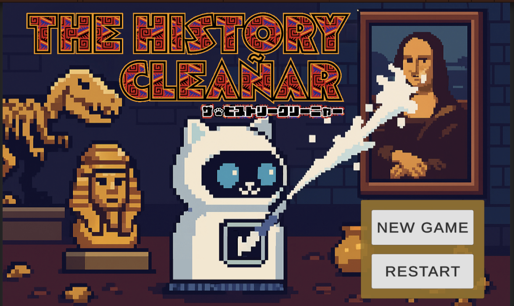  
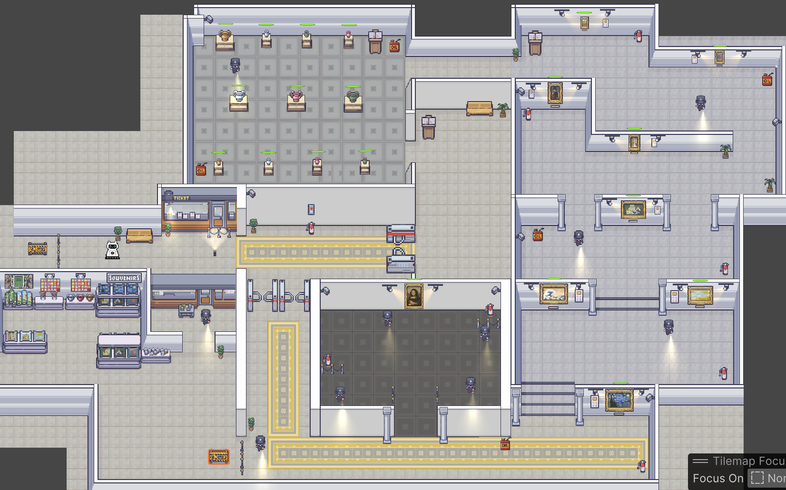  
※ 通常ゲーム操作中は、Global lightで館内を薄暗く設定しています。

## 操作方法
前後・左右　移動：WASDキー、または矢印キー  
モップアタック・ブリーチスプレー：スペースキー  
消化器攻撃：左シフトキー 
説明を読む：Eキー

## 注意
* 追いかけてくる警備員に消化器を投げつけると煙が発生し、警備員の動きを一時的に止めることができます。
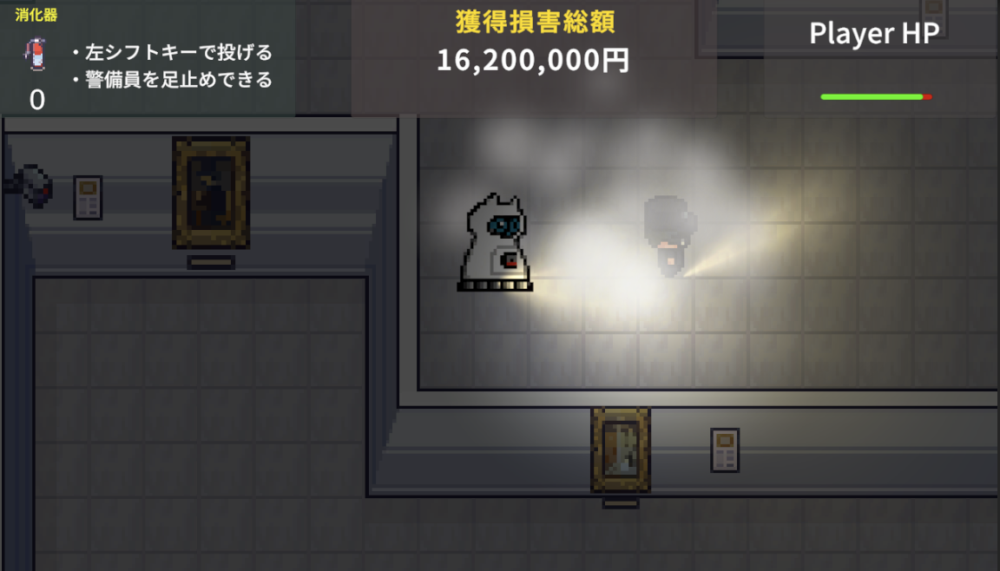 
* 陶磁器を壊す時はモップアタック、絵画を破壊する時はブリーチスプレーが自動で切り替わります。
* プレイヤーにもHPがあり、歩行、攻撃のたびに少しづつHPが減っていきます。HP0でゲームオーバーとなるので注意！ 
* 館内に置いてあるオイルを拾うとHPが100パーセントまで一気に回復します。 
* 警備員に捕まると、1発アウトでゲームオーバーとなります。
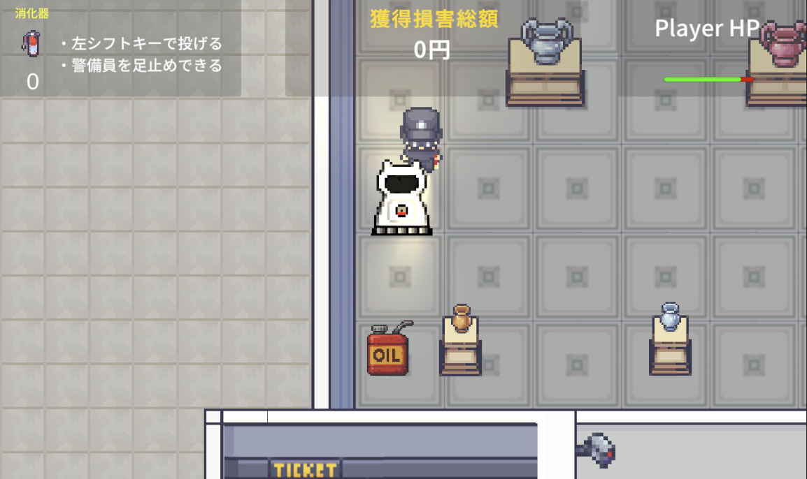  


## 制作について
* 制作期間：20日間 
* 使用エンジン：Unity Editorバージョン 6000.0.54f1 
* 使用言語：C#  
* 使用アセット：
itch.io→美術館のタイル素材、展示品や警備員のアセットの購入先
* BGM、SE：
dova-s.jp->bgm
効果音ラボ->ロボットの操作音などのSE
どうぶつ語音声ジェネレーター->オープニングシーンで猫型ロボットたちの音声を生成
* Fontデータ： Noto Sans JP-Medium SDF (TMP_Font Asset)  
* デザインツール：Adobe Illustrator、Adobe Photoshop
* そのほかの使用ツール：GitHub、SorceTree、Visual Studio Code


## ゲームフロー
* オープニングシーン  
ストーリーに入り込むために、「バグが起こって暴走してしまう猫ロボ」が伝わる演出を狙いました。あえて説明を明確に行わないことで、プレイスタートしてから詳細がわかる楽しさを残しています。 
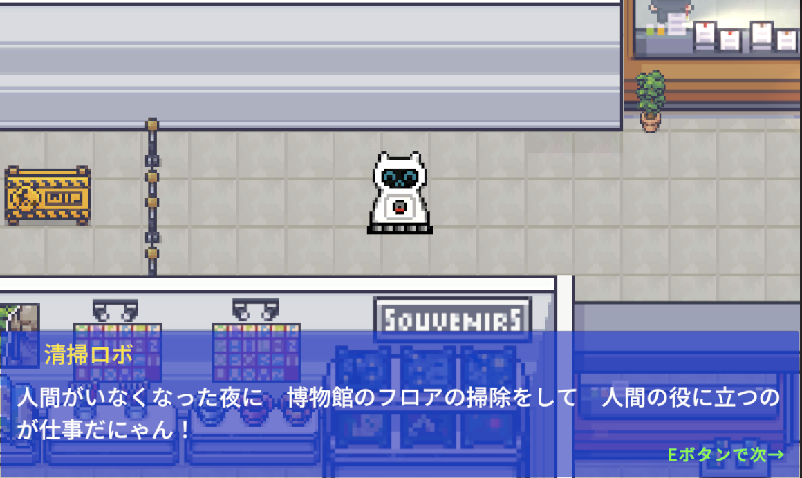  
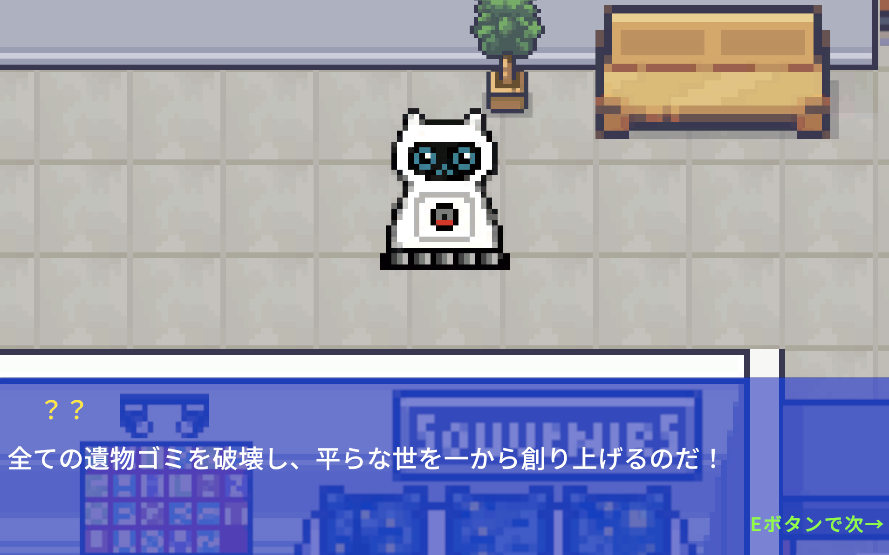 
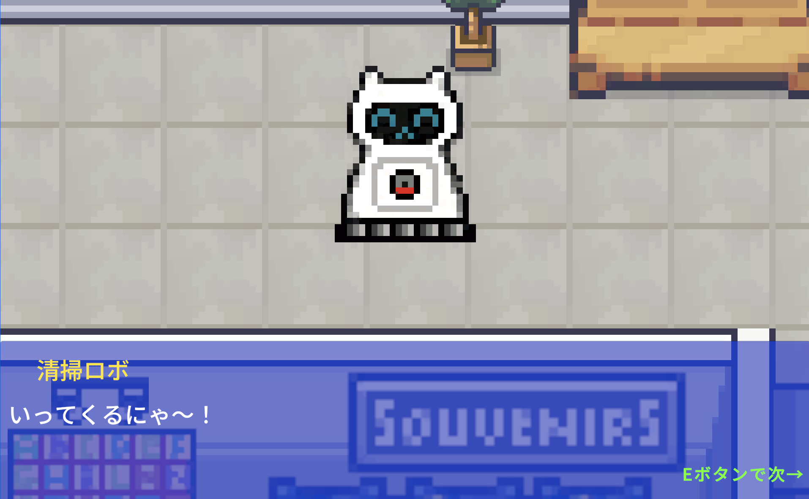  

* エントランス（操作パート）  
薄暗い館内に置いてあるスポットライトを拾い進みます。ライトの近くに消化器が置いてあり、近づくと操作方法などの説明を読むことができます。入り口ゲートをくぐって、館内に入室します。
  
  
* 陶磁器ブース（操作パート）   
陶磁器の破壊可能な領域に入ると、陶磁器のHPパラメーターが表示されます。全て赤に変わるまで、スペースキーを押し、粉々になるまで破壊しましょう！大きな陶磁器は叩く回数がより必要です。大きさ・色によって獲得損害額も異なります。
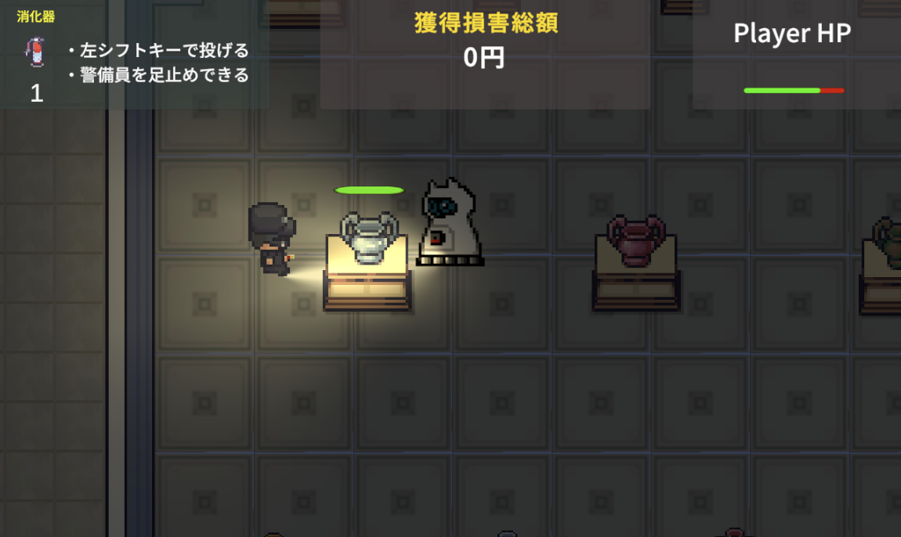
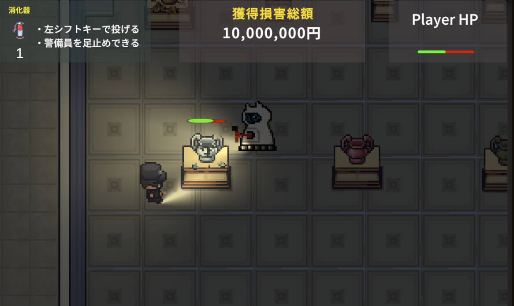

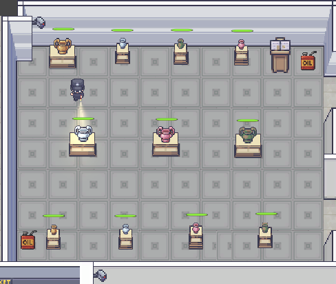

* 絵画ブース （操作パート）
陶磁器と同じように、絵画にもHPパラメーターが表示されます。ブリーチスプレーを一度行えば損害額を獲得！有名なものほど高額な損害額をゲットできます。
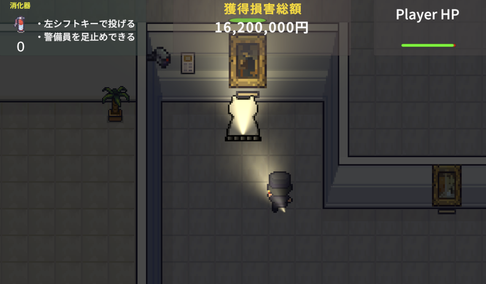
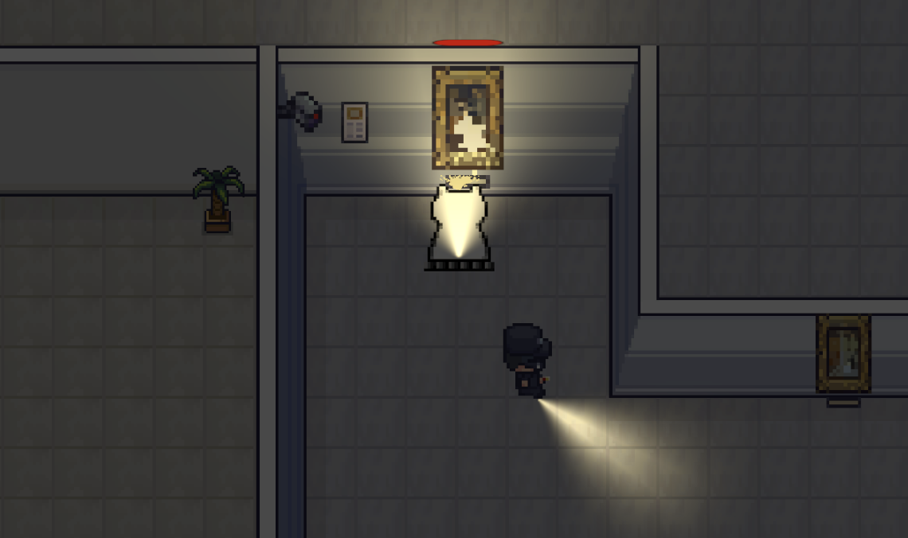
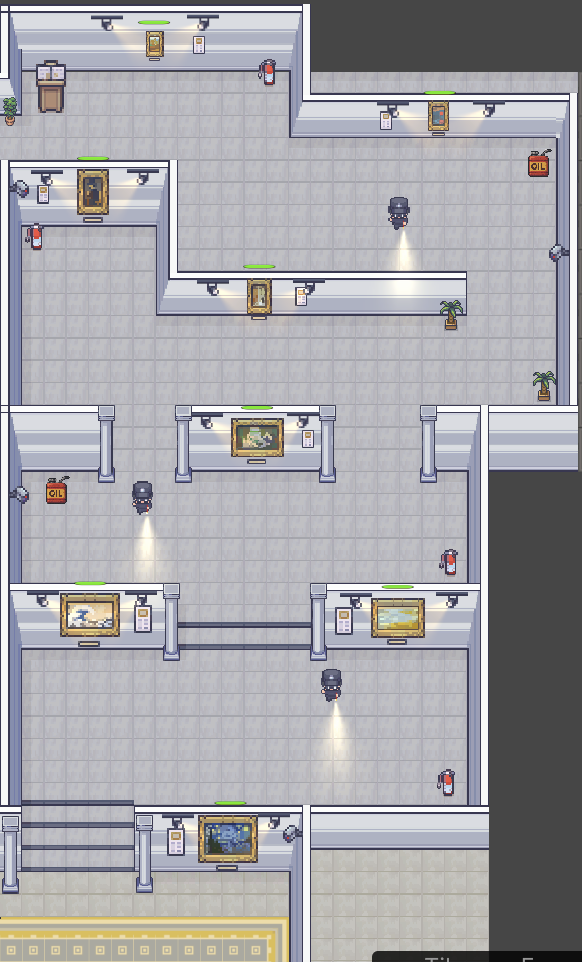  

* モナリザブース （BOSS:操作パート） 
警備員が多く配置されたブースを進み、モナリザにブリーチスプレーをかけます。このブースはスルーしてゴールゲートで直行することも可能です。難易度が高いので、その分、獲得損害額も高く設定されています。
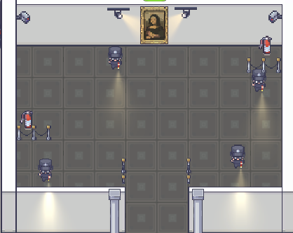  

* エンディングシーン  
エンディングではニュース速報のSEやBGMにあわせて、獲得損害総額が表示されます。ゲームオーバーになった場合でもその時点での総額が表示されます。
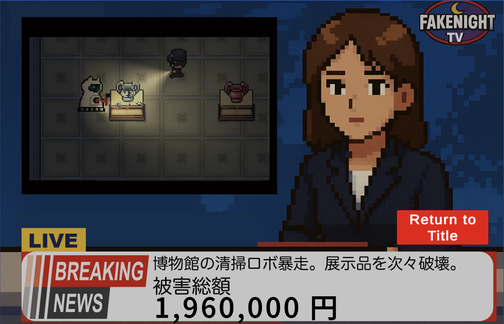  
  

### Player 3つのアクション  
Playerの猫型清掃ロボには、展示品に応じた２つの攻撃方法と、警備員に対する攻撃の合計３つの攻撃手段を持たせています。
* モップアタック（陶磁器の破壊用）  
* ブリーチスプレー（絵画の破壊用）  
* 消化器シュート（警備員の足止め用） 

## モップアタックとブリーチスプレーについて
展示品には「ExhibitBreakController.cs」を付与し、Playerがそれぞれの攻撃をすると、陶磁器や絵画は、破壊段階に応じてスプライトを切り替える「HitOnce」がPlayerより呼び出されます。

```C#
// 1ダメージ（モップ/スプレー）が入った時にPlayerから呼ぶ
    public void HitOnce()
    {
        bool broken = data ? data.ApplyDamage(1) : false;

        // 段階表示を進める
        if (pics != null && pics.Length > 0 && num < pics.Length - 1)
        {
            if (CompareTag("Pottery"))//陶磁器なら
            {
                SoundManager.instance.SEPlay(SEType.Attack);//壊れる音を鳴らす
            }

            num++;
            ApplyStage();
        }

        if (broken)
        {
            // 完全破壊の演出があればここで（SE/VFX/Destroy 等）
            // Destroy(gameObject, 0.05f);
        }
    }
```

プレイヤーには「PlayerCOntroller.cs」を付与し、繰り返し（UpDate）の中で、それぞれの展示品に対する攻撃コルーチンを作成。その中でHitOnceを呼び出し、Playerがスペースキーを押すたびに、展示品が自らのスプライトを変更します。
  
```C#
 if (Input.GetButtonDown("Jump"))
        {
            // 中略
            if (!inAttack && isPainting)
            {
                int dir = RefreshDirection();     // 0:Front 1:Back 2/3:Side
                if (dir == 0) //正面を向いているなら
                {
                    Debug.Log("Front では Bleach 不可");
                    return; // コルーチンを抜ける
                }
                else
                {
                    StartCoroutine(BleachSpray(touchObject));
                    Debug.Log("絵をブリーチ！");
                }
            }
            else if (!inAttack && isPottery)
            {
                StartCoroutine(MopAttack(touchObject));
                Debug.Log("陶器こわす！");
            }
        }
```
```C#
IEnumerator MopAttack(GameObject targetGO) //陶磁器に対する攻撃
    {
        //中略
        //時間差で接触した相手の相手の姿や状態を替える
        if (targetGO && targetGO.TryGetComponent(out ExhibitBreakController ex)) ex.HitOnce();

        inAttack = false; //モップアタック中フラグをOFFにする
        anime.SetBool("attack", false);
    }

    IEnumerator BleachSpray(GameObject targetGO) //絵画に対する攻撃
    {
        //中略
        //時間差で接触した相手の相手の姿や状態を替える
        if (targetGO && targetGO.TryGetComponent(out ExhibitBreakController ex)) ex.HitOnce();

        inBleach = false; //モップアタック中フラグをOFFにする
        anime.SetBool("bleach", false);
    }

```
  
### 倒したときの爽快感
博物館という現実的なステージをテーマとしながらも、ゲームだからこそできる「展示品を破壊する」背徳感を大切にしました。モップアタックをした時に鳴る陶磁器の「カチャン！」としたSE、絵画にスプレーを吹きかけた時の「シューッ！」というSEにこだわリました。それらを完全に壊した後の損害金額獲得の「チャリン！」という音も追加することで、完全に破壊したタイミングをわかりやすくしつつ、ポップでシュールな楽しさを演出しました。また、Endingシーンにて獲得総額を表示することで、プレイヤーに達成感と余韻を残し、さらに甚大な損害額を狙って、もう一度プレイしてみたくなるような手応えを目指しました。  


### テーマを選択した理由
このゲームの発想は、ある問いから始まりました。
「もしも現実の博物館に“無敵の人”が現れ、展示品を破壊したらどうなるのか？」
近年、電車内や公共空間で無差別事件が実際に起きています。
「暴力が突然文化空間に侵入する」という出来事は、もはや荒唐無稽な想像ではありません。
本作は、そうした社会的リアリティの延長線上で、
「文化を壊すとは何を意味するのか」「人間が作った秩序はどれほど脆いのか」
を考えるための“もしも”の世界を提示します。

### 今後の課題
今回は限られた制作期間の中で完成まで作り上げる必要があったため、あらゆる妥協が必要でした。
* 展示品：本来、「ツタンカーメンの銅像」「恐竜の骨格」など博物館らしい展示品も破壊するストーリーを考えていましたが、それらのアセットを破壊用にアレンジする時間が足らず、諦めてしまいました。
* ボスステージ：モナリザが配置されたブースは当初、赤いレーザーを部屋に張り巡らせ、そのレーザーに当たらないように進む想定で考えていた。しかし、それらのスクリプトが間に合わず、警備員を大量に配置することで済ましてしまいました。

上記の点についてはぜひ次回に追加してみようと思います。

<!-- ## 歴史学・研究背景
この作品の根底には、制作者の専門分野である古代中国の刑罰史・考古資料研究があります。
とくに「刑徒俑（けいとよう）」当時の罪人を模した俑（人形）が本作の思想的な基盤になっています。
刑徒俑は、人間の「罪」や「罰」が物質として可視化された存在であり、
古代の社会がどのように暴力を制度化し、記憶として残したかを示しています。
つまり文化財とは、単なる美術品ではなく、
**暴力・死・支配の記録を保存したもの**でもあるのです。

プレイヤーが操作する清掃ロボットは、破壊者であると同時に清掃者です。歴史的遺物を破壊する行為は、それらの痕跡を「消去」ことでもあります。

この二重性――遺物の「破壊」と痕跡の「消去」――こそが本作の中心的なテーマです。
プレイヤーの行動（清掃）は、暴力の後始末を続ける現代社会の姿を反映しています。
それは、ニュースやSNSのタイムラインの中で事件を“処理”し、
すぐに忘却していく私たち自身の行為とも重なります。 -->


<!-- 
```C#
 //HPがなくなったら削除
if (bossHP <= 0)
{
    //爆発音を鳴らす
    audioSource.PlayOneShot(se_Explosion);

    //爆発エフェクトの生成
    GameObject obj = Instantiate(
        explosionPrefab,
        transform.position,
        Quaternion.identity
        );

    obj.transform.SetParent(transform); //爆発がボスについていくように
    Destroy(gameObject, 1.0f); //エフェクト分1秒まってからボスの消失

    //消滅からゲームステータスが変わるまでの時間差コルーチン
    StartCoroutine(BossDestroy());
}

//撃破からエンディングにいくまでの時間差（余韻）
IEnumerator BossDestroy()
{
    yield return new WaitForSeconds(5.0f); //5秒待つ
    GameManager.gameState = GameState.gameclear; //ゲームステータスを変更してエンディングへ
}
```
## 共同開発におけるレビューを行いブラッシュアップ
まずは最初の2日間でプロトタイプを完成させるために担当箇所を構築しました。  
それぞれの担当箇所をGitHubを活用してマージし、当日デバッグに回れるメンバーでデバッグプレイしてプロトタイプへの評価を行いました。  
この評価に関してチームミーティングを行い、改善点と改善方法を定め残りの2日間で調整を行うことでブラッシュアップできました。  
  
  
  
## GitHub上でのマージ作業を意識して担当範囲に最新の注意
スピードが要求される制作期間において、マージ作業で大きなトラブルを生まないようチームの取り決めを忠実に順守しました。  
GitHubのIssuesを通じて進捗や問題点については随時チームへの報告や問題提起を行っています。
  
  
SourceTreeでブランチを分けてコンクリフト衝突がおこらないよう細心の注意を払いました。  
また定期的なコミットを通してバックアップも万全にしました。  
  
  
## 共同開発に関する工夫
### 仕様から反れていないかの確認作業
チームの打ち合わせで大体の方向性・仕様はあったものの、細かい部分は自身の考えに委ねられる環境でした。  
私の場合はとにかくユーザーが爽快に何回でもバトルしてみたくなる手応えを大事にしましたので、SEによる臨場感やシーン切り替えのタイミングなどを気にしました。  
一方でこだわった結果、チームとして想定された仕様や方向性から逸脱していないかも心配な部分でしたので、疑問に思った部分はチームリーダーにマメに確認をとり、マージする際の影響なども考えながら慎重に改良を重ねることができました。  
  
例えば、当時の心配ごととして、気軽に斬撃で勝てないよう近づきすぎるとボス本体からダメージ判定をもらうのを是としていたのですが、これが仕様上問題ないかはきちんと確認をいれました。  
  
### 細かいコミット作業
とにかく自分のデータにトラブルがあると、全体に影響が出てしまうので何か大きな変更を行う際にはコミットによるバージョン管理によって、いつでももとに戻れるように気を使いました。  
またコミットだけではなくプッシュを意識してクラウドにバックアップが常にある状態の維持に努めました。  
  
特にボスがタックルしてくるコルーチン制作には調整に大変苦労しましたので、コードにコメントを多く残すと同時に確実にコミットとプッシュしていくよう意識しました。
  
### 納期の意識
チーム開発ということで自分のせいで周りに影響がでないよう良い意味でプレッシャーを感じていたのですが、それ以上にこれをプレイするユーザーを意識して時間内に必ず間に合わせるという意識を大切にしました。そのために何日に何ができていないといけないという逆算に加え、さらに半日～1日余裕をもたせるようにスケジューリングしました。  
詰まってしまったところは、自分でこだわる部分とそうでない部分を「納期に間に合うか」で天秤にかけることで、リーダーに助力を乞うタイミングは基準を決めやすかったです。  
  
具体的にはボスのバリア展開について細部がどうしても腑に落ちず、自分でも追及したい気持ちが高かったのですが中間のプロトタイプまで時間が迫っていたので、逆に早めにリーダーに確認をすることとし、その代わり解説してもらった原理は徹底的に理解するように努めました。  
  
### AIの活用
自分で考えれる部分は多かったのですが、一部時短もかねてAIを大いに活用しました。  
しかし、AIが出したコードだけでは不十分なものも多かったので、大枠はAIの案を採用しつつも細部は自分で修正するという作業をしたことで出だしが早く無事納期に間に合わすことができたと思います。  
* 仕様ツール：Google AI Studio　「Gemini 2.5 Pro」

## 今後の課題
他の担当者のパートも含めゲーム全体の内容を理解はしていますが、上空を飛び交うヘリのようなNavMeshAgentコンポーネントを活用しづらいコードについては未挑戦なので、ぜひ次回以降に作ってみようと思います。  
調べたところ、いくつかの方法のうちエネミーのルーティングを行うのが一番自然だと感じましたので挑戦してみます。  
[参考サイト：Unity入門の森/移動経路の構築とOnDrawGizmosによる移動経路の可視化](https://feynman.co.jp/unityforest/game-create-lesson/tower-defense-game/enemy-route/)
  

   --> 
